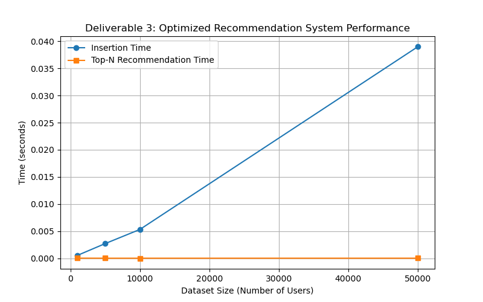

# E-commerce Recommendation System (Deliverable 2 & 3)

## Overview

This project implements an **E-commerce Recommendation System** demonstrating both a **Proof-of-Concept (PoC)** and an **Optimized Scalable Version** using Python.

The system demonstrates how efficient data structures and optimizations can be used to:

- Store user-product interactions
- Model user-product relationships using graphs
- Generate Top-N recommendations efficiently
- Benchmark performance with larger datasets

---

## Data Structures Used

| Data Structure             | Purpose                                  |
| -------------------------- | ---------------------------------------- |
| Hash Tables (Dictionaries) | Store user data and ratings              |
| Graphs                     | Model user-product relationships         |
| Heaps (Priority Queue)     | Generate Top-N recommendations           |
| Sparse Matrix              | Efficient storage of sparse interactions |

---

## ⚙️ Features

- Add users and product ratings
- Represent relationships using graphs
- Generate Top-N recommendations using heaps
- Memory-efficient sparse storage
- Benchmark performance for scalability
- Modular and maintainable design

---

## Project Structure

```text
ecommerce-recommendation-system/
│
├── src/
│   ├── user_store.py             # Deliverable 2 PoC user storage
│   ├── graph.py                  # Deliverable 2 PoC graph
│   ├── optimized_user_store.py   # Deliverable 3 optimized user storage
│   ├── optimized_graph.py        # Deliverable 3 optimized graph
│   ├── heap_recommender.py       # Top-N recommendation heap
│   ├── sparse_matrix.py          # Sparse matrix for efficient storage
│   ├── benchmark.py              # Benchmark and stress testing module
│   └── main.py                   # Main script for D2 & D3
│
├── tests/
│   ├── test_recommender.py       # Unit tests for recommendation correctness
│   └── test_stress.py            # Stress tests and benchmark validation
│
├── results/                      # Stores generated performance graphs
│   └── performance_graph.png
│
├── screenshots/                  # Screenshots for report
│   ├── d2_output.png
│   └── d3_performance.png
│
├── Project Phase 1 Deliverable 1.pdf
├── Project Phase 2 Deliverable 2.pdf
├── Project Phase 3 Deliverable 3.pdf
├── README.md
└── requirements.txt
```

---

## How to Run

### 1. Clone Repository

```bash
git clone https://github.com/YOUR_USERNAME/ecommerce-recommendation-system.git
cd ecommerce-recommendation-system
```

### 2. Install Dependencies

```bash
pip install -r requirements.txt
```

> Ensure `matplotlib` is installed for plotting performance graphs.

### 3. Run Application

```bash
python -m src.main
```

**Output**:

- **Deliverable 2 (PoC)**: Top-N recommendations for sample users
- **Deliverable 3 (Optimized)**:
  - Insertion and Top-N recommendation times for multiple dataset sizes
  - Performance graph saved at: `results/performance_graph.png`

---

## Run Tests

```bash
pytest
```

- Unit tests: `tests/test_recommender.py`
- Stress tests / benchmark: `tests/test_stress.py`

---

## Example Output

**Deliverable 2 (PoC)**

```
=== PHASE 2: Proof-of-Concept (Deliverable 2) ===
Top Recommendations (D2 PoC): ['P4', 'P3']
```

**Deliverable 3 (Optimized)**

```
Dataset size: 1000
Insertion Time: 0.0005s, Top-N Time: 0.0000s
Dataset size: 5000
Insertion Time: 0.0027s, Top-N Time: 0.0000s
...
Performance graph saved: results/performance_graph.png
```

---

## Limitations

- Uses randomly generated ratings (no ML predictions yet)
- Performance testing limited to synthetic datasets
- Top-N recommendations do not yet incorporate collaborative filtering or ML

---

## Future Improvements

- Integrate collaborative filtering or ML-based recommendation models
- Test with real-world e-commerce datasets
- Further optimize memory usage for very large datasets
- Implement API-based real-time recommendations

---

## Screenshots

**Deliverable 2 Output (PoC)**


**Deliverable 3 Performance Graph**


---

## 👩 Author

**Shreya Rai**
**Course Number: MSCS-532-B01**

---

## References

- Aggarwal, C. C. (2016). _Recommender Systems_
- Koren, Y., Bell, R., & Volinsky, C. (2009). _Matrix Factorization Techniques for Recommender Systems_
- He, X., Liao, L., Zhang, H., Nie, L., Hu, X., & Chua, T. (2017). _Neural Collaborative Filtering_
